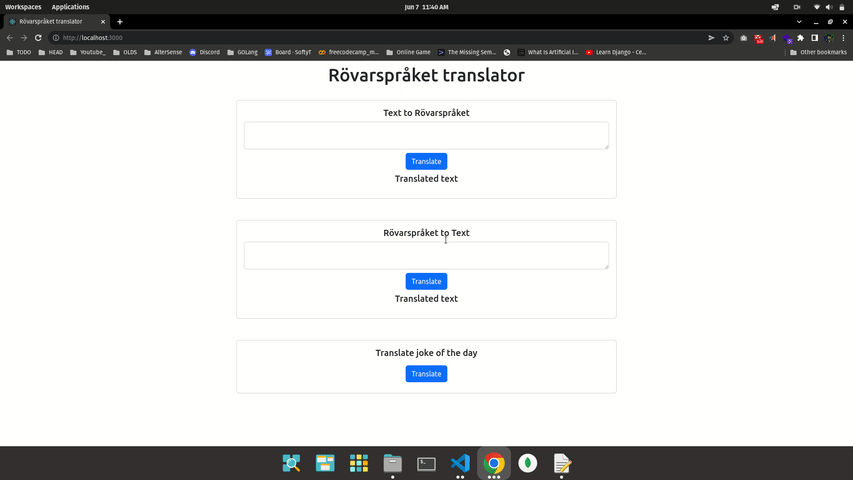

# Rövarspråket translator

#### Clone Project
`git clone https://github.com/codewithrafiq/translator.git`

## Run Backend First

#### Change Directory
`cd api/`

#### Install Requirements.
`npm i`

#### Run Backend
`npm start`

### Backend running on 'http://0.0.0.0:3030'

<hr>

## Run Frontend
<p> First cd out from api directory, then go ui directory</p>

`cd ..`

#### Go to Ui Directory
`cd ui`

#### Install Requirements.
`npm i`


#### Run Frontend
```
    sudo npm install -g serve
    serve -s build 
```

### Frontend running on "http://0.0.0.0:3000" 

<hr>

## Demo Video of Working Project 
### - Demo video: [Drive Link](https://drive.google.com/file/d/15dlueFTgeSrDy7hLOv-x2XZCYienZwRH/view?usp=sharing)


